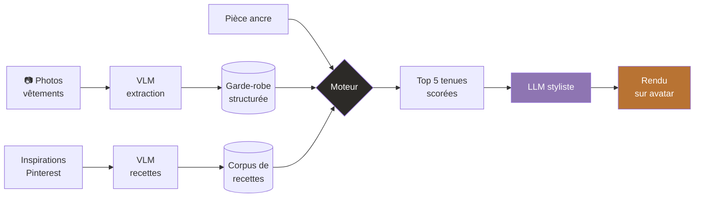
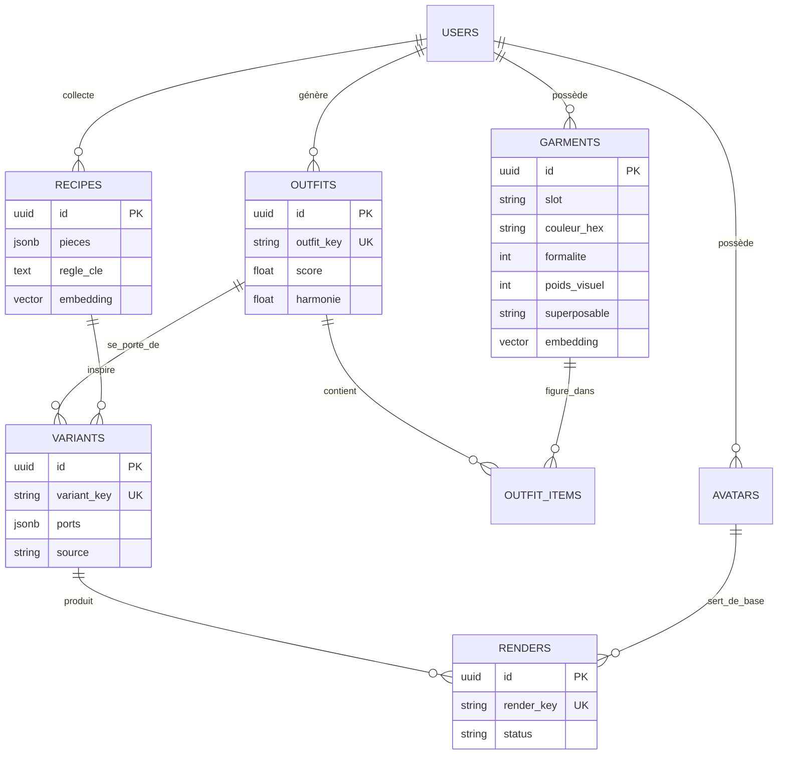

<div align="center">

#  Dressup

**Un assistant de garde-robe qui compose des tenues avec ce que vous possédez déjà,
inspirées de votre propre style, et rendues en photo sur votre avatar.**


<br/>


</div>

---

## Le problème

Une garde-robe de 40 pièces contient plusieurs milliers de combinaisons possibles.
On en porte une vingtaine. Les applications existantes proposent soit un catalogue
à faire défiler, soit des suggestions génériques qui ignorent ce qu'on possède
réellement.

**Dressup part de l'inverse** : vous choisissez une pièce que vous voulez porter
aujourd'hui, et le système construit autour, en s'appuyant sur des références de
style que vous avez vous-même sélectionnées.

---

## Comment ça marche



Le pipeline sépare volontairement deux régimes de calcul :

| | Algorithme | LLM |
|---|---|---|
| **Portée** | environ 800 combinaisons | top 5 uniquement |
| **Coût** | nul | 0,001 € / appel |
| **Latence** | millisecondes | secondes |
| **Déterminisme** |  reproductible |  variable |
| **Explicabilité** |  score décomposable |  boîte noire |

> **L'algorithme filtre, l'IA affine.**
> Passer un LLM sur toute la combinatoire coûterait des dizaines d'euros par
> requête pour un résultat non reproductible.

---

## Ce qui est intéressant techniquement

###  Un scoring colorimétrique en HSL

L'harmonie ne se calcule pas en RGB, la distance numérique n'y correspond à rien
de perceptuel. En **HSL**, la teinte devient un angle sur le cercle chromatique, et
l'harmonie devient de la géométrie.

| Écart de teinte | Relation | Score |
|---:|---|---:|
| 0–25° | camaïeu | `0.85` |
| **25–45°** | **zone bâtarde** | **`0.35`** |
| 45–100° | analogue | `0.60` |
| 100–140° | triadique | `0.75` |
| 140–180° | complémentaire | `0.80` |

La courbe **n'est pas monotone**. Le creux à 25–45° traduit le principe du
*near miss* : assez proche pour que l'œil cherche à lire les couleurs comme
identiques, assez loin pour qu'il échoue. Rater de peu est perceptuellement pire
que rater franchement.

S'y ajoutent une détection des **neutres** (une garde-robe réelle en est
majoritairement composée), un malus de saturation, un **point focal unique** par
tenue, et des règles de **hiérarchie entre couches superposées**.

###  Une affectation sous contrainte, avec seuil de rejet

Le cœur du moteur mappe les pièces d'une recette d'inspiration sur les vêtements
réellement possédés.

```python
if _piece_compatible(piece, meilleur) < SEUIL_AFFECTATION:
    manquants.append(slot)      # on laisse le slot vide
    continue                     # plutôt qu'affecter une approximation
```

> Une recette reconstituée à moitié n'est pas une tenue « inspirée de Pinterest »,
> c'est du bruit.

Trois familles de contraintes cohabitent :

- **Dures** — écart de formalité, superposabilité, complétude de la silhouette
- **Continues** — harmonie colorimétrique, couverture de la recette
- **De diversité** — pénalité de répétition, pour éviter dix fois la même pièce

###  Le hachage comme identité

Trois niveaux de cache, chacun dimensionné au coût qu'il protège :

```python
render_key = sha256(f"{avatar_id}|{variant_id}|{provider}")
```

L'inclusion du **provider** rend l'invalidation gratuite : changer de modèle
d'image périme automatiquement tout l'ancien cache. Même principe que les
*content hashes* dans les bundles front — l'invalidation devient une conséquence
de l'identité, pas une opération séparée.

| Cache | Protège | Économie |
|---|---|---|
| `outfit_key` | recalcul + doublons | écriture BDD |
| `styling_spec` | appel LLM | latence + tokens |
| `render_key` | génération d'image | **0,04 € / rendu** |

###  Tenue ≠ façon de la porter

Une même combinaison de vêtements se porte de plusieurs manières. C'est une
distinction produit qui s'est révélée être, formellement, une **violation de la
3ᵉ forme normale** :

```
outfit.id → styling_spec → justification, ports
            └── dépendance transitive
```

D'où l'extraction d'une entité `Variant`. L'intuition produit et la décomposition
formelle convergent, la normalisation encode une propriété réelle du domaine.

###  Le styliste transpose, il ne recopie pas

L'inspiration dit *« rentré dans le pantalon »*, mais vous portez une jupe. Un LLM
intermédiaire réécrit chaque instruction pour les vêtements réels, et produit une
description **visuelle** plutôt qu'un geste :

```diff
- "mi-rentré"
+ "l'avant disparaît sous la ceinture, l'arrière retombe sur les hanches"
```

Le modèle d'image génère ce qu'on lui **décrit**, pas ce qu'on lui demande de
faire. Cette reformulation seule a nettement amélioré la fidélité des rendus.

---

## Modèle de données



Quelques partis pris :

- **UUID** plutôt qu'entiers séquentiels : pas d'énumération possible via l'API
- **JSONB** pour les attributs descriptifs : on normalise ce sur quoi on raisonne,
  on dénormalise ce qu'on transporte
- **`user_id` en clé étrangère partout dès le premier jour** : le multi-utilisateur
  était préparé structurellement bien avant d'être exposé
- **Contraintes d'unicité en base**, pas seulement dans le code : la règle survit
  aux bugs applicatifs

---

## Stack

<table>
<tr><td><b>Backend</b></td><td>FastAPI · SQLAlchemy 2.0 · Pydantic · JWT + bcrypt</td></tr>
<tr><td><b>Données</b></td><td>PostgreSQL 16 + pgvector · Docker Compose</td></tr>
<tr><td><b>IA</b></td><td>Gemini 3 (vision, texte) · Nano Banana Pro (image) · embeddings 3072d</td></tr>
<tr><td><b>Frontend</b></td><td>React · Vite</td></tr>
</table>

### Pourquoi un monolithe modulaire

Les microservices résolvent des problèmes **organisationnels** (plusieurs équipes
déployant indépendamment) et de **charge très inégale** entre composants. Aucun des
deux ne se pose ici.

Le vrai goulot est le coût des rendus : 1 000 utilisateurs × 10 tenues/mois × 0,04 €
= **400 €/mois**. Aucun découpage en services ne réduit ce chiffre d'un centime.

Les frontières logiques existent (`styling/`, `rendering/`, `api/`) sans import
latéral entre modules. Extraire le worker de rendu, seul composant au profil de
charge vraiment différent, resterait une journée de travail le jour où ce serait
justifié.

---

## Feuille de route

```mermaid
gantt
    dateFormat X
    axisFormat %s
    section Fondations
    Smoke test du rendu        :done, 0, 1
    Ingestion garde-robe       :done, 1, 2
    Extraction de recettes     :done, 2, 3
    section Moteur
    Scoring colorimétrique     :done, 3, 4
    Retrieval + affectation    :done, 4, 5
    LLM styliste               :done, 5, 6
    Cache et quotas            :done, 6, 7
    section Application
    API + authentification     :done, 7, 8
    Front multi-pages          :active, 8, 9
    OAuth Pinterest            :9, 10
    section Suite
    Détection sémantique       :10, 11
    Météo et occasions         :11, 12
```



| |
|---|
| Pipeline complet, de la photo au rendu |
| Moteur explicable et réglable |
| Multi-utilisateur, isolation par requête |
| Front : garde-robe, tenues, paramètres |
| Pinterest OAuth *(accès Trial en attente)* |
| Suggestion contextuelle : météo, agenda, occasion |
| Apprentissage des préférences via les rendus conservés |

---

## Démarrage

```bash
git clone https://github.com/kaoutharboulouiz/Dressup.git
cd Dressup

python -m venv .venv && source .venv/bin/activate   # .venv\Scripts\Activate.ps1
pip install -r requirements.txt
cp .env.example .env                                 # renseigner les clés

docker compose up -d
python -m app.db

fastapi dev app/api/main.py                          # :8000
cd front && npm install && npm run dev               # :5173
```

<details>
<summary><b>Variables d'environnement</b></summary>

| Variable | Rôle |
|---|---|
| `GEMINI_API_KEY` | Vision, texte, embeddings et génération d'image |
| `JWT_SECRET` | Signature des jetons |
| `DATABASE_URL` | Postgres + pgvector |
| `MAX_RENDERS_PAR_JOUR` | Garde-fou budgétaire |
| `PINTEREST_APP_ID` / `_SECRET` | OAuth (optionnel) |

</details>

---

## Vie privée

Usage strictement personnel : les photos ne quittent pas la machine, en dehors des
appels aux modèles. Les images d'inspiration ne sont **jamais stockées** — seule la
recette structurée dérivée est conservée. Les mots de passe sont hachés avec bcrypt,
les secrets vivent hors du dépôt.

---
